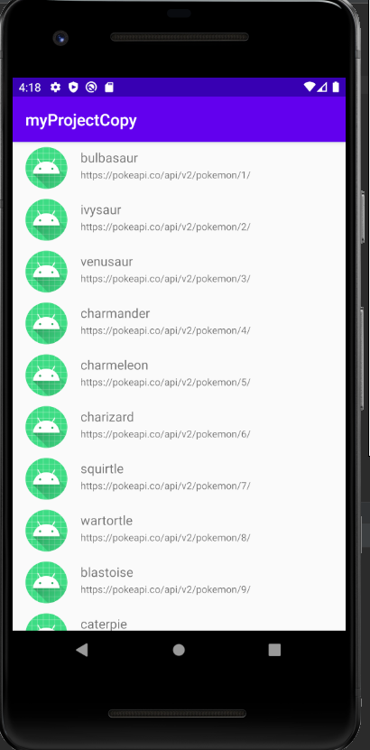

# myProjectCopie

## Présentation
Cette application permet de visualiser une liste de pokemon. Cette liste est chargée à partir de l'api rest pokeapi disponible sur le lien suivant: https://pokeapi.co/api/v2/pokemon . Elle permet lors de la selection d'un item de la liste d'afficher des détails sur un élément plus particulièrement le nom et un lien ppour trouver des infos complémentaires.
## Prérequis
* Avoir installé Android Studio  
* Télécharger la branche master de ce projet
## Consignes respectées 
* Consignes de base  
  * Ecran avec une liste d’éléments  
  * Ecran avec le détail d’un élément  
  * Appel WebService à une API Rest  
  * Stockage de données en cache  
* Consignes supplémentaires  
  * [x] Architecture :  
    * [x] Singleton
    * [x] Design Patterns
    * [x] MVC / MVP / MVVM
    * [x] Principes ( SOLID, KISS, DRY )
  * [ ] Gitflow 
  * [ ] Design
  * [ ] CI / CD
  * [ ] TDD / TU
  * [ ] Coroutines ou Rxjava
  * [ ] Notifications Push ( Firebase ) 
  * [ ] Autres fonctionnalités (libre à vous, plus il y en a mieux c’est.)  
## Fonctionnalités  
Lorsque l'application s'ouvre, elle charge les données en cache puis affiche une liste des éléments de l'api. Cette liste permet de voir le nom de l'élément en première ligne puis un url en deuxième ligne.

  

Lorsque l'on clique sur l'icone android d'un item, cela ouvre une nouvelle fenêtre qui charge le nom et l'url voulus.  

  

  
